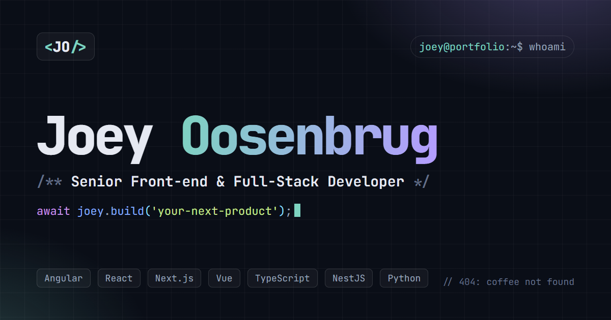

# Joey Oosenbrug · Portfolio

[](https://joeyoosenbrug.nl)

My personal portfolio: a fast, static website that shows who I am, what I have built and where I have worked.

**Live:** [joeyoosenbrug.nl](https://joeyoosenbrug.nl) · [Nederlands](https://joeyoosenbrug.nl/nl/)

## About me

I'm a **senior front-end and full-stack developer** from Druten, the Netherlands, with more than five years of experience building web applications, SaaS platforms and technical products for the public sector, real estate, media and e-health. Right now I help Dutch government organisations get ready for post-quantum cryptography.

- **Front-end:** Angular, React, Next.js, Vue.js, TypeScript
- **Back-end & infra:** NestJS, Python, FastAPI, Kubernetes, Proxmox, CI/CD
- **How I work:** ownership of the full chain, clean architecture, accessibility, tests, and a steady supply of coffee

I'm employed by [Competa IT](https://competa.com) and work on client projects.

- LinkedIn: [joey-oosenbrug](https://www.linkedin.com/in/joey-oosenbrug-3a7975171/)
- GitHub: [@joeykwispel](https://github.com/joeykwispel)
- Email: [joey.oosenbrug@gmail.com](mailto:joey.oosenbrug@gmail.com)

## What's on the site

- A one-page overview: about, skills, insights (charts), experience, projects, open-source contributions, writing, recommendations and contact
- **Case studies** (`/work/<slug>/`): the problem, what I did, the trade-offs and the result
- **Writing** (`/writing/`): notes on things I built
- A printable **CV** (`/cv/`) with "Save as PDF"
- English at `/`, Dutch at `/nl/`, dark and light theme

## How it's built

|           |                                                                                                                                           |
| --------- | ----------------------------------------------------------------------------------------------------------------------------------------- |
| Framework | SvelteKit 2 + Svelte 5, TypeScript, plain CSS                                                                                             |
| Output    | Fully prerendered static HTML (adapter-static) on GitHub Pages                                                                            |
| Data      | One source of truth in `src/lib/data`. Skill durations, charts and stats are derived from role dates, with overlapping roles counted once |
| i18n      | Route-based (`[[lang=lang]]`), with `hreflang` alternates, a per-language `<html lang>` and a generated sitemap                           |
| Privacy   | Self-hosted fonts, cookie-less Cloudflare Web Analytics, no cookie banner needed                                                          |
| Security  | Content Security Policy with hashes for every inline script (as a `<meta>` tag, since GitHub Pages can't set headers)                     |
| Freshness | Open-source PR state, stars and diff stats are fetched from the GitHub API at build time; the site rebuilds every Monday                  |

```
src/
  lib/data/shared/       language-neutral data: roles, skills, projects, case studies, posts
  lib/data/locales/en|nl text per language (TypeScript checks the Dutch file against the English one)
  lib/components/        sections and UI
  routes/[[lang=lang]]/  pages; the optional segment is empty for English and "nl" for Dutch
scripts/                 build-time scripts (GitHub PR sync)
e2e/                     Playwright end-to-end and axe accessibility tests
```

## Quality checks

Every pull request runs:

- **Prettier + ESLint** (`npm run lint`) and **svelte-check** (`npm run check`)
- **Vitest** unit tests for the date maths, derived stats, i18n paths and data integrity (`npm run test:unit`)
- **Playwright** end-to-end tests on desktop and mobile, plus an **axe** WCAG 2.2 AA scan of every page in the sitemap in both themes, drafts included (`npm run test:e2e`)
- **Lighthouse CI** with budgets: accessibility and SEO ≥ 95 are required, performance ≥ 90 is a warning ([`lighthouserc.json`](lighthouserc.json))

Dependabot opens grouped weekly updates for npm and GitHub Actions.

## Adding a case study or post

1. Add an entry to `src/lib/data/shared/caseStudies.ts` (or `posts.ts`) with `status: 'draft'`.
2. Add the text to `src/lib/data/locales/en/` and `nl/` (same file name). The unit tests check that both languages have the same sections.
3. Review it with `npm run dev`. Drafts are visible there with a banner, and in a build with `VITE_SHOW_DRAFTS=1`.
4. Set `status: 'published'` and merge. It then appears on the home page and in the sitemap.

Want to run it yourself? See **[docs/GETTING_STARTED.md](docs/GETTING_STARTED.md)**.

## License

The **code** is released under the [MIT License](LICENSE), so feel free to use it for your own portfolio.

Third-party parts (Lucide, Feather and GitHub Octicons icon paths, the bundled Svelte libraries, and the self-hosted Inter and JetBrains Mono fonts) keep their own permissive licenses, all compatible with MIT. Their notices are in [static/THIRD-PARTY-NOTICES.txt](static/THIRD-PARTY-NOTICES.txt), which also ships with the website.

The **content** is not covered by that license: my CV text, work history, case studies, posts, the recommendation quote, my name and the social preview image (`static/og.png`) remain © Joey Oosenbrug. If you fork this, replace the data in `src/lib/data/` with your own.
